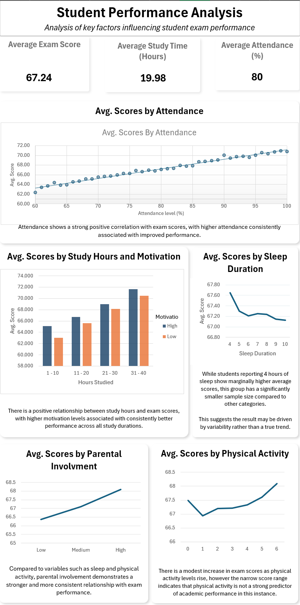

# Student Performance Analysis (Excel)

## Overview  
This project analyses key factors influencing student exam performance using Excel-based data analysis and visualisation.

The goal was to identify which variables have the strongest impact on exam scores, including attendance, study habits, motivation, sleep, and parental involvement.

---

## Dashboard  

---

## Key Insights  

- **Attendance is the strongest predictor** of exam performance, showing a clear positive correlation with exam scores  
- **Study hours and motivation** both contribute positively, with motivated students consistently achieving higher results  
- **Parental involvement** shows a steady positive relationship with performance  
- **Sleep and physical activity** show relatively weak relationships, with minimal variation in scores  

---

## Tools Used  
- Microsoft Excel  
- Pivot Tables  
- Data Cleaning  
- Data Visualisation  
- Dashboard Design  

---

## Additional Feature  
An interactive student lookup tool was created using Excel formulas (**XLOOKUP**), allowing users to retrieve individual student data dynamically.

---

## Skills Demonstrated  
- Data analysis and interpretation  
- Data visualisation and dashboard design  
- Analytical thinking and insight generation  
- Excel-based data manipulation  
